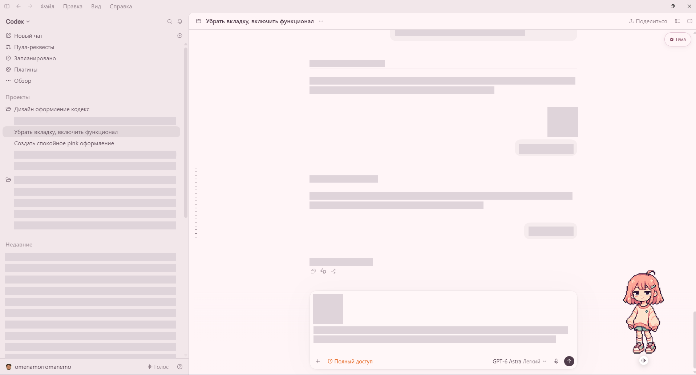
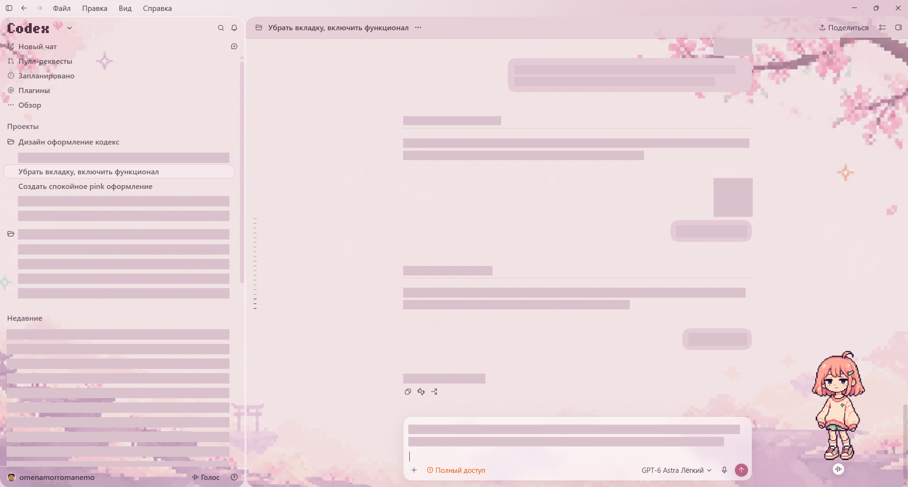

# Pink Glass ♡

Неофициальная тема для Codex на Windows: сакура, розовое стекло и пиксельные логотипы Codex / ChatGPT.

## До и после

Настоящие скриншоты приложения. Личные названия, переписка и черновик сообщения закрыты плашками; остальное изображение сохранено без перерисовки. «До» — оформление с выключенным Pink Glass в том же профиле, а не заводские настройки Codex. Питомец виден на скриншотах, но устанавливается отдельно и в тему не входит.

### Чат

| До | После |
| --- | --- |
|  |  |

### Новый чат

| До | После |
| --- | --- |
|  |  |

**[Скачать для Windows — 0.8.11 beta](https://github.com/omenamor/codex-pink-glass/releases/download/v0.8.11-beta/PinkGlass-Setup-0.8.11-beta.zip)**

## Установка

1. Установите официальный Codex для Windows x64.
2. Скачайте и полностью распакуйте `PinkGlass-Setup-0.8.11-beta.zip` из релиза.
3. Запустите `Setup.vbs`.
4. Полностью закройте Codex после завершения задач и откройте ярлык **Pink Glass**.

Node.js включён. На новом профиле применяется сохранённый комплект оформления. Если старая тема уже есть, её настройки сохраняются; импортируйте `theme.json` из папки установки для вида из этой сборки.

Меню **Тема** позволяет менять цвета и фон, сохранять их и выключать оформление для сравнения. Кнопка скрывается через 6 секунд без наведения.

## Отключение

Полностью закройте Codex и откройте обычным ярлыком. Для удаления также удалите `%LOCALAPPDATA%\PinkGlass` и ярлык Pink Glass. Сохранённые настройки темы останутся в профиле Codex.

## Статус беты

Локально проверены установка в новую папку, защита существующей установки, откат после ошибки, оформление в Edge, оба логотипа, автоскрытие и отключение. Проверка на другом компьютере ещё нужна. Будущие обновления Codex могут потребовать адаптации.

Запуск использует локальное отладочное подключение `127.0.0.1:9337`, доступное локальным программам до полного выхода из Codex. Файлы установленного приложения не изменяются. Подробнее — README внутри архива. Не является продуктом OpenAI.

