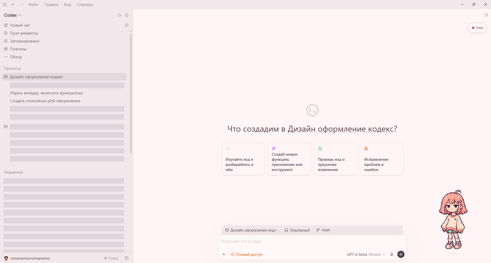
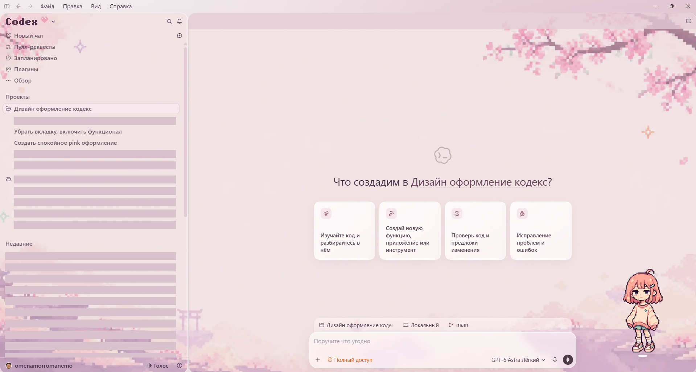

# Pink Glass ♡

**Пять настраиваемых тем для Codex на Windows:** Sakura, Lavender, Moonlight, Peach и Mint.

Неофициальное оформление с эффектом стекла, фонами и редактором цветов. Плагин помогает устанавливать, включать, отключать и настраивать тему прямо из задачи Codex. Windows x64; Node.js включён в комплект.

**[Скачать плагин для Windows](https://github.com/omenamor/codex-pink-glass/releases/download/v0.10.28/PinkGlass-Plugin-0.10.28.zip)** · [Все выпуски](https://github.com/omenamor/codex-pink-glass/releases) · [Сообщить об ошибке](https://github.com/omenamor/codex-pink-glass/issues)

## Установка из каталога плагинов

В терминале с установленным Codex CLI выполните:

```powershell
codex plugin marketplace add omenamor/codex-pink-glass
codex plugin add pink-glass@pink-glass-community
```

Затем откройте **новую задачу** в Codex и напишите:

> Используй Pink Glass: установи и включи оформление.

Установщик проверит файлы и создаст на рабочем столе ярлык **Codex Pink Glass**. Если Codex открыт без подключения темы, завершите активные задачи, полностью закройте приложение и запустите этот ярлык. Плагин не закрывает Codex принудительно.

## Установка из архива

1. Скачайте архив по ссылке выше и полностью распакуйте его в постоянную папку.
2. Откройте эту папку как проект в Codex.
3. Напишите: **«Установи локальный плагин Pink Glass из этой папки, затем включи оформление»**.

В архиве находятся каталог `.agents/plugins/marketplace.json` и сам плагин `plugins/pink-glass`. Если устанавливаете вручную через терминал из распакованной папки:

```powershell
codex plugin marketplace add .
codex plugin add pink-glass@pink-glass-community
```

После установки откройте новую задачу и попросите включить Pink Glass. Не запускайте `.vbs` прямо внутри ZIP.

## Темы и управление

| Тема | Характер |
| --- | --- |
| Sakura | Розовое оформление |
| Lavender | Лавандовое оформление |
| Moonlight | Ночная тема |
| Peach | Персиковое оформление |
| Mint | Мятное оформление |

Примеры запросов:

- «Включи тему Moonlight в Pink Glass».
- «Открой настройки Pink Glass» — цвета, прозрачность, фон и размеры.
- «Проверь, включён ли Pink Glass».
- «Отключи Pink Glass».

Настройки профилей сохраняются. Обновление плагина не сбрасывает цвета и не перезаписывает файлы работающего оформления. Если прежняя версия ещё включена, завершите задачи и при следующем обычном запуске используйте обновлённый ярлык.

## Что нового в 0.10.28

В этот выпуск вошли исправления оформления, проверенные во всех пяти темах:

- Ровная тонкая обводка по всему контуру поля ввода, включая главную страницу и фокус ввода.
- Спокойная верхняя строка с общей подложкой вместо отдельных «капсул» вокруг кнопок.
- Обои снова видны между сообщениями. Подложки ответов имеют внутренние отступы и не выступают за края.
- У заголовка «Что создадим…» убраны лишняя заливка и тень.
- Строки поиска, команд и другие служебные подписи больше не получают фон обычного ответа.
- Исправлены углы панелей, цвет разделителя, фоны очереди сообщений и плашек изменённых файлов. Зелёные и красные счётчики сохранены.
- Ползунок «Приглушить фон слева» управляет полным диапазоном: 0% — без дополнительного приглушения, 100% — ровный фон без рисунка. Обои основной области не меняются.

Настройки профилей сохраняются. Актуальные файлы устанавливаемого плагина находятся в [`plugins/pink-glass`](plugins/pink-glass); старые файлы в корне оставлены для предыдущих выпусков.

## Пример оформления

Исторические скриншоты Sakura из версии 0.8.11. Текущая версия добавляет ещё четыре темы. Личные названия и переписка скрыты плашками. Питомец устанавливается отдельно и в Pink Glass не входит.

| До | После |
| --- | --- |
|  |  |

## Как это работает

Pink Glass добавляет стили и редактор через локальное отладочное подключение `127.0.0.1:9337`. Файлы установленного Codex не изменяются. Это не официальный API тем и не продукт OpenAI. Веб-версия ChatGPT, macOS и Linux этой сборкой не поддерживаются.

Ключи API и внешние сервисы не нужны. Отладочное подключение доступно локальным программам, пока Codex полностью не закрыт. Будущие обновления Codex могут потребовать адаптации оформления. Выпуск остаётся бета-версией: проверка полного запуска на другом компьютере ещё нужна.

## Отключение и удаление

Попросите Codex отключить Pink Glass. Также можно полностью закрыть Codex и открыть его обычным ярлыком. Удаление плагина из списка само по себе не останавливает уже запущенный коннектор. После отключения можно удалить плагин и ярлык. Настройки темы сохраняются в профиле Codex.

## English

Pink Glass is an unofficial Windows x64 appearance plugin for Codex, with five customizable themes: Sakura, Lavender, Moonlight, Peach and Mint. Install the marketplace and plugin with the commands above, start a new Codex task, and ask it to install and enable Pink Glass. If a restart is required, finish your tasks, fully quit Codex, then use the **Codex Pink Glass** desktop shortcut. Node.js is bundled. Version 0.10.28 includes continuous composer outlines, cleaner header controls, visible wallpaper between messages, corrected sidebar dimming and theme-consistent secondary surfaces. Saved theme settings are preserved. It does not support the ChatGPT website, macOS or Linux.

## License

Original Pink Glass code is available under the [MIT License](LICENSE). Bundled Node.js and its dependencies retain their own notices in [THIRD_PARTY_NOTICES.md](THIRD_PARTY_NOTICES.md). OpenAI, Codex and ChatGPT names and marks belong to their respective owners; this project is not affiliated with or endorsed by OpenAI.
