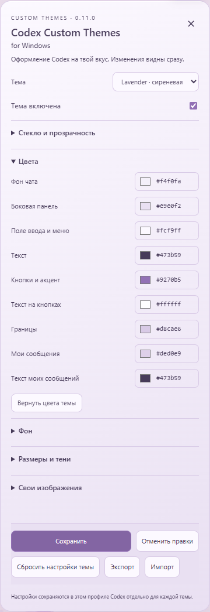
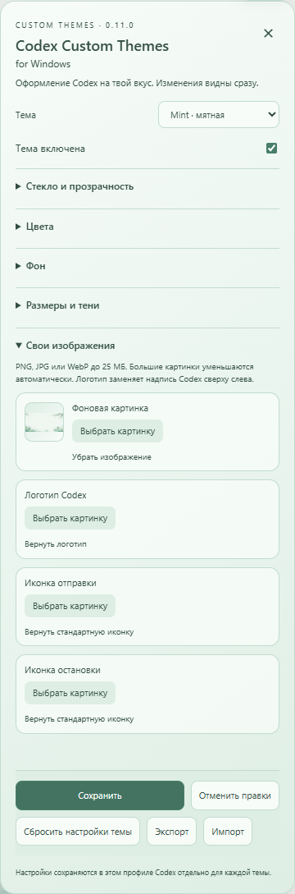
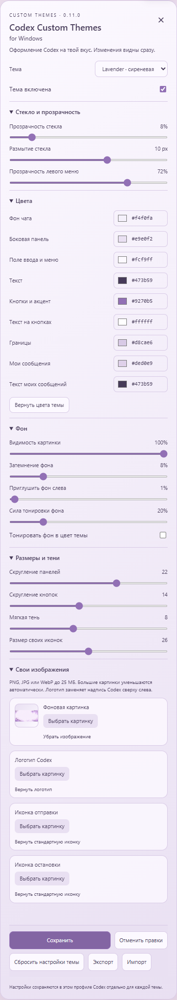
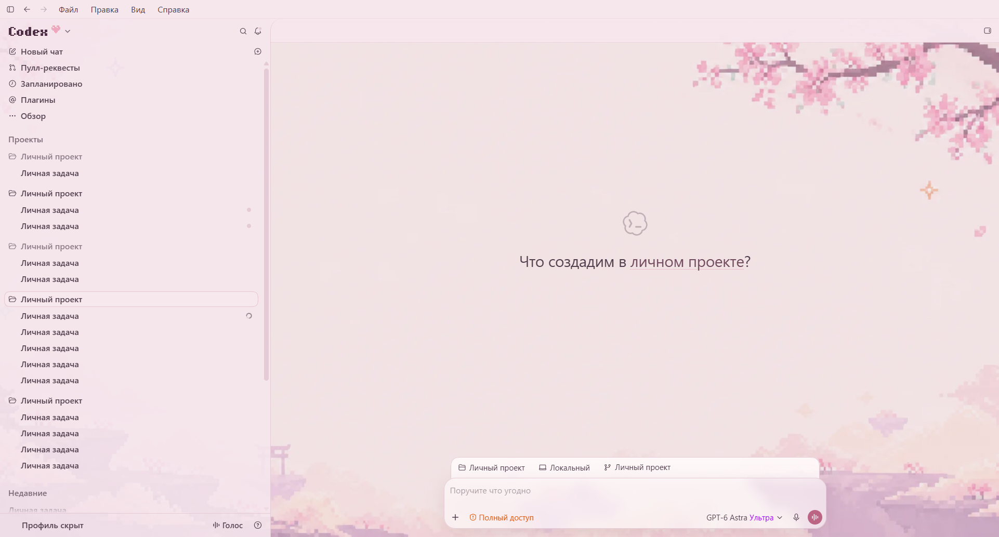
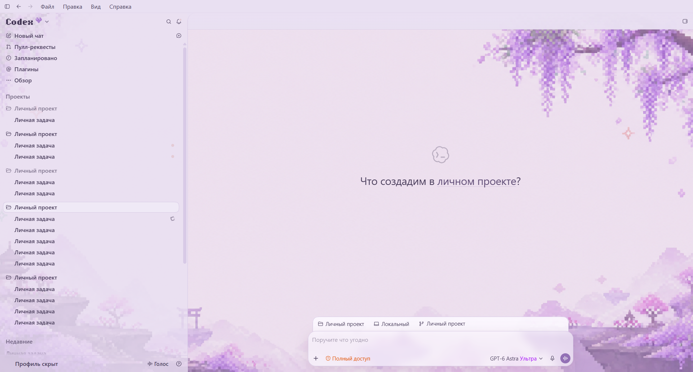
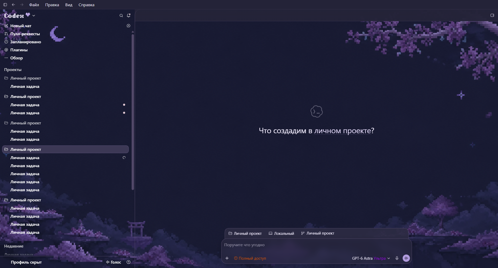
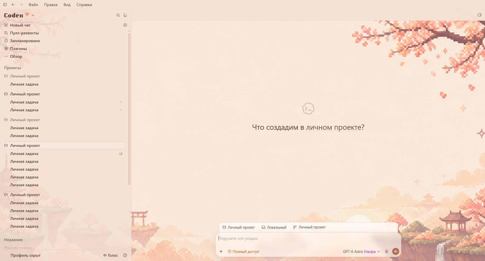
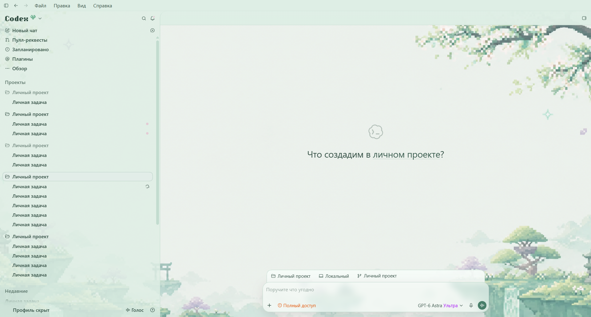

# Codex Custom Themes for Windows

**Настрой Codex под себя: пять готовых тем, свои обои, цвета и стеклянные поверхности.**

Раньше приложение называлось **Pink Glass**. Теперь название сразу говорит, для чего оно: оформление Codex на Windows. Все сохранённые темы совместимы с обновлением.

**[Скачать установщик Windows](https://github.com/omenamor/codex-pink-glass/releases/download/v0.11.0/Codex-Custom-Themes-Windows-Setup-0.11.0.exe)** · [ZIP плагина](https://github.com/omenamor/codex-pink-glass/releases/download/v0.11.0/Codex-Custom-Themes-Windows-Plugin-0.11.0.zip) · [Все выпуски](https://github.com/omenamor/codex-pink-glass/releases) · [Сообщить об ошибке](https://github.com/omenamor/codex-pink-glass/issues)

## Установка как обычного приложения

1. Установите официальный Codex для Windows, если его ещё нет.
2. Скачайте и запустите **Codex-Custom-Themes-Windows-Setup-0.11.0.exe**.
3. Пройдите мастер установки. Приложение устанавливается для текущего пользователя; Node.js уже в комплекте.
4. Завершите задачи и полностью закройте Codex, затем откройте ярлык **Codex Custom Themes for Windows** в меню «Пуск» или на рабочем столе.

Установщик не закрывает Codex и не запускает оформление автоматически. Удалить приложение можно через параметры Windows. Ваши сохранённые профили тем остаются в Codex. Установщик пока без цифровой подписи; рядом с EXE опубликована контрольная сумма SHA-256. Если политика Windows блокирует PowerShell-скрипты, запускатель покажет сообщение; приложение не меняет системную политику. Подробности — в [инструкции установщика](installer/README.md).

## Удобное меню кастомизации

Откройте **«✿ Тема»** в правом верхнем углу. Кнопка становится видимой при наведении в эту область. При установленном плагине также можно написать: **«Открой меню настройки темы»**.

Выберите готовую палитру и настройте её под себя. Изменения отображаются сразу, без перезапуска.



| Раздел | Возможности |
| --- | --- |
| **Стекло и прозрачность** | Прозрачность поля ввода, размытие стекла и прозрачность боковой панели. |
| **Цвета** | Девять цветов: фон, боковая панель, поле ввода и меню, основной текст, акцент, текст кнопок, границы, фон и текст своих сообщений. Выбор через палитру или HEX. |
| **Фон** | Видимость обоев, затемнение, приглушение слева, тонировка в цвет темы и её сила. |
| **Размеры и тени** | Скругление панелей и кнопок, мягкая тень и размер своих иконок. |
| **Свои изображения** | Загрузка собственного фона, логотипа и иконок отправки и остановки. |

### Свои обои и изображения

В разделе **«Свои изображения»** нажмите **«Выбрать картинку»**. Можно использовать PNG, JPG и WebP до 25 МБ; большие изображения уменьшаются автоматически. Настройте видимость картинки, затемнение и тонировку так, как вам нравится. Файлы обрабатываются локально.



<details>
<summary>Все настройки редактора на одном снимке</summary>



</details>

Прозрачность стекла **0%** даёт непрозрачную поверхность; большее значение показывает больше фона. Подложки текста ответов сохраняют отдельную защиту читаемости. Системное уменьшение прозрачности имеет приоритет. В Moonlight подписи бокового меню остаются белыми.

Ползунок **«Приглушить фон слева»**: **0%** — без дополнительного приглушения; **100%** — ровный фон без рисунка. Основная область при этом сохраняет свои обои.

### Сохранение, отмена и перенос темы

- **Сохранить** — записать настройки текущей темы.
- **Отменить правки** — вернуться к последнему сохранённому состоянию.
- **Вернуть цвета темы** — сбросить только цвета.
- **Сбросить настройки темы** — восстановить текущую тему целиком.
- **Экспорт** — скачать JSON текущей темы вместе со своими изображениями.
- **Импорт** — открыть JSON как предпросмотр; затем нажать «Сохранить».

Каждая из пяти тем хранит свой профиль. При переключении текущие изменения тоже сохраняются. Сброс одной темы не меняет остальные. Экспорт может содержать ваши фотографии — проверьте их перед передачей файла другим людям.

## Все пять тем

Примеры оформления текущей версии. Личные названия проектов и задач, профиль и персональные подсказки заменены нейтральными подписями; аватар скрыт. Переписки на снимках нет. Снимки меню сделаны на отдельном демонстрационном экране.

### Sakura

Мягкая розовая палитра и цветущая сакура.



### Lavender

Лавандовая палитра и светлый фон.



### Moonlight

Ночная тема с луной и белым текстом меню.



### Peach

Тёплые персиковые оттенки.



### Mint

Мятная палитра с зелёными акцентами.



## Установка как плагина Codex

В терминале с Codex CLI:

```powershell
codex plugin marketplace add omenamor/codex-pink-glass
codex plugin add pink-glass@pink-glass-community
```

Откройте новую задачу и напишите: **«Установи и включи Codex Custom Themes for Windows»**.

Адрес репозитория и технические идентификаторы `pink-glass` / `pink-glass-community` сохранены для совместимости. Вариант EXE не требует установки плагина через CLI; плагин добавляет управление оформлением через задачи Codex.

ZIP содержит плагин и локальный каталог установки. Полностью распакуйте архив и выполните в его папке:

```powershell
codex plugin marketplace add .
codex plugin add pink-glass@pink-glass-community
```

## Что изменилось в 0.11.0

- Новое название и обычный установщик Windows с ярлыками и удалением через параметры системы.
- Проверены настройки всех пяти тем, выбор цвета, свои изображения, сохранение, отмена и импорт/экспорт.
- Ползунок прозрачности теперь действительно меняет поле ввода; тень в Moonlight регулируется.
- В меню доступны свои иконки отправки и остановки, а элементы загрузки следуют выбранной палитре.
- Исправлены контраст кнопки сохранения, проверка HEX и восстановление фокуса с клавиатуры.
- Незавершённая загрузка изображения не переносится в другую тему при переключении.
- Включено исправление светлой растушёвки: подложка верхней панели заканчивается на её границе.

Для новых профилей прозрачность стекла по умолчанию — 8%, что сохраняет мягкий, хорошо читаемый вид. Существующие значения не сбрасываются; после обновления ранее перекрытый ползунок начинает действовать.

Проверки выпуска: **40 автоматических тестов**, отдельная проверка Windows Setup и обновления 0.10.34 → 0.11.0. Контрольные суммы опубликованы рядом с файлами.

## Совместимость и принцип работы

Неофициальное оформление для **Codex на Windows x64**. Файлы Codex не переписываются: оформление и редактор подключаются через локальный отладочный порт `127.0.0.1:9337`. Ключи API и платные сервисы не нужны. Обновления Codex могут потребовать адаптации оформления. Веб-версия ChatGPT, macOS и Linux этой сборкой не поддерживаются.

Чтобы временно вернуть обычный вид, снимите **«Тема включена»** в редакторе. Чтобы прекратить подключение, отключите оформление через плагин либо полностью закройте Codex и запустите его обычным ярлыком.

## English

**Codex Custom Themes for Windows** (formerly Pink Glass) is an unofficial Windows appearance app for Codex. It includes five presets and a live customization menu: colors, HEX input, glass transparency, blur, wallpaper dimming and tint, rounded corners, shadows, custom backgrounds, logos and action icons. Save each preset separately or import/export a theme as JSON.

Download the Windows EXE above, run the setup wizard, fully quit Codex, then launch **Codex Custom Themes for Windows** from Start or your desktop. Node.js is bundled. A Codex plugin installation is also available through the legacy-compatible commands above. Personal labels and avatars are hidden in the gallery.

## License

Original code is under the [MIT License](LICENSE). Bundled components retain their notices in [THIRD_PARTY_NOTICES.md](THIRD_PARTY_NOTICES.md). Windows installer source and build instructions are in [installer](installer/README.md). OpenAI, Codex and ChatGPT names and marks belong to their respective owners; this project is not affiliated with or endorsed by OpenAI.
